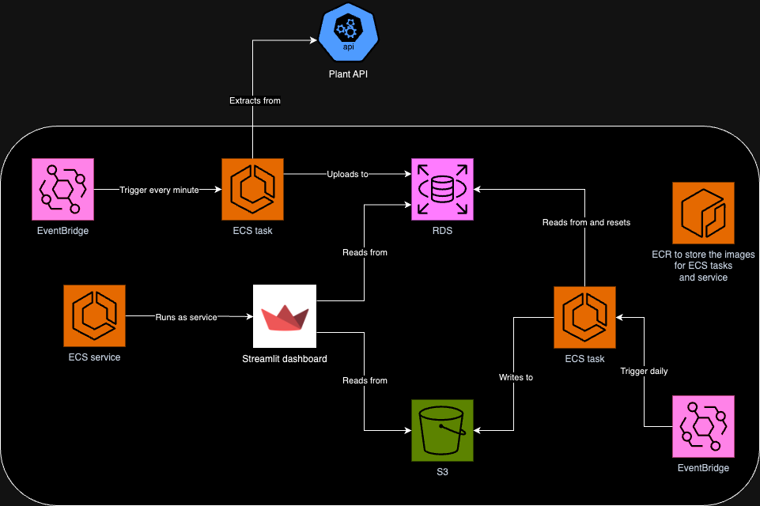
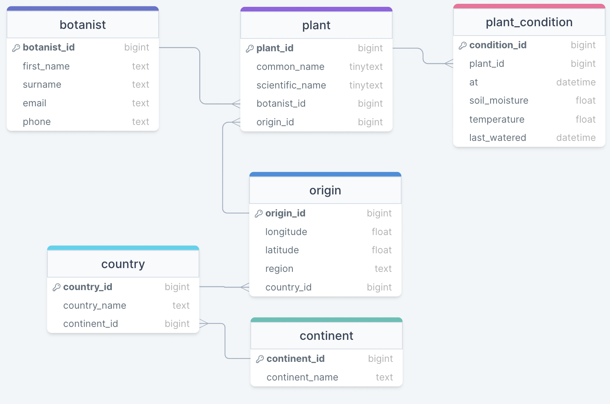

# Museum Plant Monitoring Project
This project is a case study that aims to provide a means of monitoring the health of a range of plants in a museum over time. Currently, the museum has an API that reports only the **current** health of a plant. Developing a pipeline to extract the data from the API and storing it in long term storage allows theoretical gardeners to be warned of any problems that may arise through the analysis of gathered data. This is what the project ultimately aims to address: the extraction of the museum data, long term storage of the data, and data visualisations to provide insights to the plants' wellbeing.

## Cloud architecture
A high level overview of the cloud architecture can be seen below:

### How it works
There are two key pipelines here:

#### API Pipeline
The first part is to extract data from the API then load it into a database for short term storage. The database in question will be a Microsoft SQL Server within an RDS. This pipeline will run as an ECS task that is triggered every minute using an EventBridge running on a schedule.

#### Loading to long-term storage
The data from the RDS needs to be moved to a long-term storage solution, which in this case is an S3 bucket.
The loading of the long-term database is conducted by a pipeline that is triggered every day by an EventBridge. The task triggered is an ECS task that reads from the RDS then uploads the contents to the S3 as a CSV file. The data within the RDS is then reset. The other key part of this project is dash-boarding. The dashboard here will be run using Streamlit and is hosted as an ECS service.

One final feature shown here is the dashboard:

#### Dashboard
For this project, a dashboard is provided using Streamlit. The dashboard here is run as a service within an ECS cluster. The dashboard would read from the RDS so that it can obtain real-time data and it would also read from the S3 obtain historical data as well.

## ERD
An ERD which clearly describes the tables in the schema and the data stored in each table:

#### The Plant Condition Table
This table is where the data will be uploaded to and will contain all the important information about the plant's health. This includes the soil moisture, the temperature, the time it was last watered and the time when the data was inputted.

#### The Plant Table
This table will contain all the details about each plant including the plant's common, scientific name, a link to the origin table and a link to the botanist table. This will allow for the plant to be identified when tracking it's condition.

#### The Botanist Table
This table will contain all the details about the botanists responsible for looking after the plants. This table will include all details of the botanist so they can be contacted if any of their plants become unhealthy.

#### The Origin Table
This table will contain all the details about the plants' origins including the latitude, longitude and the name of the region where the plant was found. This table also includes a link to the country table which also links to the continent table.