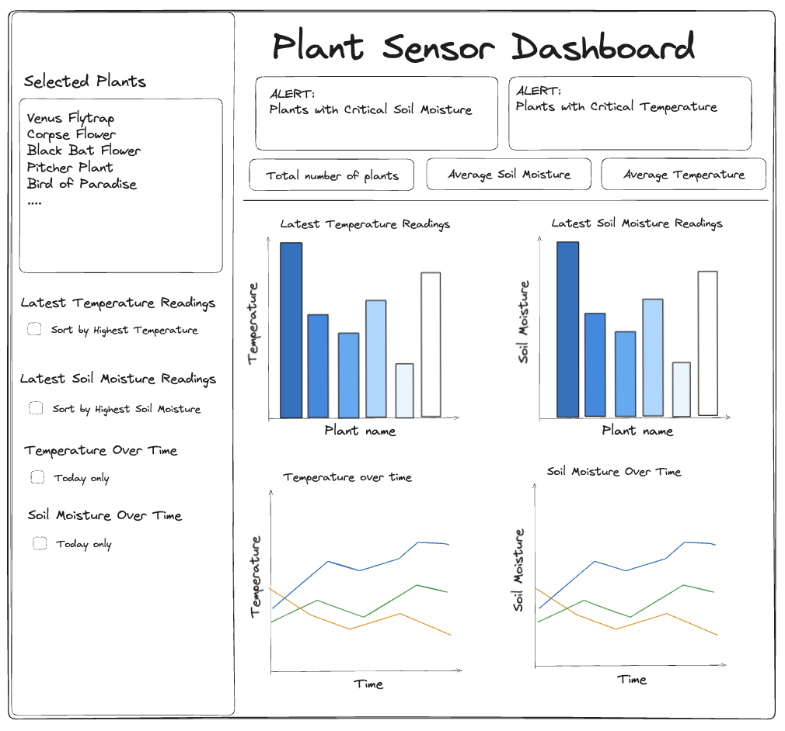

# Plant Sensor Dashboard

This folder should contain all code and resources required to create a Streamlit dashboard from the data generated in the pipeline file.
The files in this folder are used to connect to the database, make visualisations and deploy them to a streamlit app. 

## Installation and Requirements

- It is recommended before stating any installations that you make a new virtual environment. 
- A new environment will be required for each folder in this repository.

- Install all requirements for this folder: `pip3 install -r requirements.txt`.

- Create a `.env` file with `touch .env`

- **Required env variables**: 
    - DB_HOST               -> Arn to your AWS RDS.
    - DB_PORT               -> Port the AWS RDS runs on. (e.g. If using T-SQL this typically uses 1433)
    - DB_USER               -> Your database username.
    - DB_NAME               -> Your database name.
    - DB_PASSWORD           -> Password to access your database.
    - AWS_ACCESS_KEY_ID     -> Your AWS access key ID to connect to AWS.
    - AWS_SECRET_ACCESS_KEY -> Your AWS secret access key to connect to AWS.
    - BUCKET_NAME           -> The name of your bucket containing .parquet files.

## Files 

- `requirements.txt` : This file contains all the required packages to run any other files
- `database.py` : Makes a connection to the remote database and joins tables via an sql query. 
- `parquet_extract.py` : This downloads all of the long term data from the S3 bucket to make visualisations with.
- `Dockerfile` : This file contains instructions to create a new docker image that runs `app.py`.
- `app.py` : Imports functions from the below and creates the streamlit dashboard layout.    
  - `utilities.py` : loads all data and merges tables Whilst getting important data.
  - `visualisations.py` : Creates graphs and tables for the streamlit dashboard.
  - `notebook.ipynb` : Used to create test queries before implementation to the app. 

## Wireframe Design 

